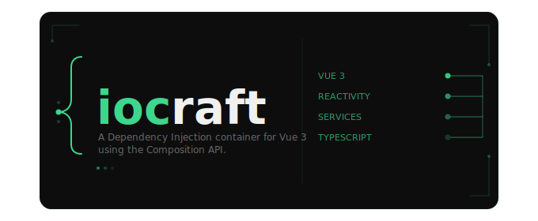

<div align="center">
  

[](https://www.npmjs.com/package/iocraft)
[](./LICENSE)
[](https://www.typescriptlang.org/)

</div>


**iocraft** is a dependency injection container for Vue 3 built on the Composition API. Write plain TypeScript classes as services with full Vue reactivity, lifecycle hooks, and zero boilerplate.


## Table of Contents

- [Installation](#installation)
- [Setup](#setup)
- [Services](#services)
- [Obtaining Services](#obtaining-services)
- [Store](#store)
- [Context (Scoped) Services](#context-scoped-services)
- [Lifecycle Hooks](#lifecycle-hooks)
- [Router Integration](#router-integration)


## Installation

```bash
npm install iocraft
```


## Setup

```ts
import { createApp } from 'vue'
import { iocraft } from 'iocraft'
import App from './App.vue'

const app = createApp(App)
app.use(iocraft)
app.mount('#app')
```

With options:

```ts
app.use(iocraft, {
  router,                    // enables the built-in Nav service
  eagerLoad: [AuthService],  // instantiate on boot, not on first use
})
```


## Services

Decorate a class with `@attach()` to register it with the DI system.

```ts
import { ref, computed } from 'vue'
import { attach } from 'iocraft'

@attach()
export class CounterService {
  count = ref(0)
  double = computed(() => this.count.value * 2)

  increment() {
    this.count.value++
  }

  reset() {
    this.count.value = 0
  }
}
```

`@attach()` assigns a unique symbol token to the class that the registry uses for lookup. Without it, iocraft cannot resolve the service and will throw.


## Obtaining Services

### `obtain` — Global Singleton

Resolves a singleton from the root registry. Created once on first call, reused for the lifetime of the app.

> Note: `obtain` does not return the raw class instance. Instead, it returns a facade — a thin wrapper that proxies each property through getters/setters linked to the original instance. This ensures reactivity is preserved, even when destructuring.

```vue
<script setup lang="ts">
import { obtain } from 'iocraft'
import { CounterService } from './services'

const counter = obtain(CounterService)
const { count, increment, reset } = obtain(CounterService)
</script>

<template>
  <p>Count: {{ count }} — Double: {{ counter.double }}</p>
  <button @click="increment">+1</button>
  <button @click="reset">Reset</button>
</template>
```

### `obtainNew` — Scoped Instance

Returns a fresh instance of the given service each time it is called.

> Like `obtain`, it returns a facade, so destructured properties remain reactive.

```vue
<script setup lang="ts">
import { obtainNew } from 'iocraft'
import { FormService } from './services'

const { values, errors, submit, reset } = obtainNew(FormService)
</script>

<template>
  <form @submit.prevent="submit">
    <input v-model="values.email" />
    <span v-if="errors.email">{{ errors.email }}</span>
    <button type="submit">Submit</button>
  </form>
</template>
```

### `obtainRaw` — Raw Singleton

Resolves a singleton from the root registry, just like obtain, but returns the actual class instance with no facade applied.

```ts
const auth = obtainRaw(AuthService)
```

### `obtainRawNew` — Raw Scoped Instance

Creates and returns a new raw instance of the service on every call, with no facade applied.

```ts
const uploader = obtainRawNew(UploadService)
```

## Store

`store()` generates a reactive base class you can extend in any service. Use it instead of Pinia when your state belongs inside a service.

```ts
import { attach, store } from 'iocraft'

interface UserState {
  id: string | null
  name: string
  role: 'admin' | 'user' | 'guest'
}

@attach()
export class UserStore extends store<UserState>({
  id: null,
  name: '',
  role: 'guest',
}) {
  get isAdmin() {
    return this.state.role === 'admin'
  }

  nameUppercase = this.compute(s => s.name.toUpperCase())

  setUser(id: string, name: string, role: UserState['role']) {
    this.update({ id, name, role })
  }

  logout() {
    this.reset()
  }
}
```

```vue
<script setup lang="ts">
import { obtain } from 'iocraft'
import { UserStore } from './stores'

const user = obtain(UserStore)
</script>

<template>
  <p>{{ user.state.name }}</p>
  <p>{{ user.nameUppercase }}</p>
  <button v-if="user.isAdmin" @click="user.logout">Logout</button>
</template>
```

### Store API

**`state`** — The readonly reactive state object. Access properties directly for reading; use `update()` to mutate.

```ts
user.state.name   // read
user.state.role   // read

// Don't mutate directly
user.state.name = 'x'

// Use update() instead
user.update({ name: 'x' })

```

`update(partial)` — Merge a partial object into state. Preferred when setting multiple keys at once.

```ts
user.update({ name: 'Alice', role: 'admin' })
```

`snapshot` — A plain, non-reactive copy of the current state via `toRaw`. Safe to serialize or log.

```ts
JSON.stringify(user.snapshot)
```

`pick(key)` — Read a single key from state.

```ts
const role = user.pick('role')
```

`compute(fn)` — Returns a `ComputedRef` derived from state. Stays reactive in templates and watchers.

```ts
@attach()
class CartStore extends store({ items: [] as string[], discount: 0 }) {
  total = this.compute(s => s.items.length - s.discount)
}

const cart = obtain(CartStore)
cart.total.value // reactive
```

`observe(key, cb) / observe(fn, cb)` — Watch a state key or a derived value for changes. Returns a `WatchStopHandle` to stop watching.

```ts
// Watch a key directly
this.observe('role', (next, prev) => {
  if (next === 'admin') this.loadAdminData()
})

// Watch a derived value
this.observe(s => s.items.length, (next, prev) => {
  console.log(`${next} items in cart`)
})
```

`effect(fn)` — Runs a `watchEffect` scoped to state. Re-runs whenever any accessed state property changes. Returns a `WatchStopHandle`.

```ts
this.effect(s => {
  document.title = s.name
})
```

`reset()` — Restores state to the initial values defined in `store({ ... })`.

```ts
user.reset() // back to { id: null, name: '', role: 'guest' }
```

## Context (Scoped) Services

Provide a service from a parent component and inject it into any descendant. Uses Vue's `provide` / `inject` under the hood.

**Parent:**

```vue
<script setup lang="ts">
import { exposeCtx, obtainNew } from 'iocraft'
import { CartService } from './services'

const cartService=obtainNew(CartService)
exposeCtx(cartService)
</script>
```

**Child:**

```vue
<script setup lang="ts">
import { obtainCtx } from 'iocraft'
import { CartService } from './services'

const cart = obtainCtx(CartService) // CartService | undefined
</script>
```

## Lifecycle Hooks

Services can define Vue lifecycle methods directly on the class.When `obtainNew` or `obtainRawNew` is called inside a component's setup context, iocraft detects the active component instance and automatically binds any lifecycle methods defined on the service to that component's lifecycle.

iocraft exports a typed interface for each supported hook. Implement them to get type checking and avoid typos.

```ts
import { ref } from 'vue'
import { attach } from 'iocraft'
import type { OnMounted, OnUnmounted } from 'iocraft'

@attach()
export class PollingService implements OnMounted, OnUnmounted {
  data = ref<string[]>([])
  private timer: ReturnType<typeof setInterval> | null = null

  onMounted() {
    this.timer = setInterval(() => this.fetch(), 5000)
  }

  onUnmounted() {
    if (this.timer) clearInterval(this.timer)
  }

  private async fetch() {
    // ...
  }
}
```

```vue
<script setup lang="ts">
import { obtainNew } from 'iocraft'
import { PollingService } from './services'

const { data } = obtainNew(PollingService)
// onMounted and onUnmounted fire with this component's lifecycle
</script>
```

If `obtainNew` or `obtainRawNew` is called outside of a setup context then the lifecycle hooks are silently skipped.

**Available interfaces:** `OnMounted` · `OnUnmounted` · `OnUpdated` · `OnBeforeMount` · `OnBeforeUpdate` · `OnBeforeUnmount` · `OnErrorCaptured` · `OnActivated` · `OnDeactivated` · `OnRenderTracked` · `OnRenderTriggered` · `OnServerPrefetch` · `OnScopeDispose`

> Lifecycle hooks do not run for global singletons resolved via `obtain` or `obtainRaw` — those have no component context to bind to.


## Router Integration

iocraft provides a built-in `Nav` service that exposes all routing features as a plain injectable service — no need to call `useRouter()` and `useRoute()` separately. To enable it, pass your router when registering the plugin:

```ts
app.use(iocraft, { router })
```
Once registered, `Nav` is available as a global singleton anywhere in your app:

```vue
<script setup lang="ts">
import { obtain } from 'iocraft'
import { Nav } from 'iocraft/common'

const nav = obtain(Nav)
const { push } = obtain(Nav)
</script>

<template>
  <p>Path: <code>{{ nav.path }}</code></p>
  <p>Name: <code>{{ nav.name?.toString() ?? '-' }}</code></p>
  <p>Full path: <code>{{ nav.fullPath }}</code></p>
  <button @click="nav.push('/home')">Home</button>
  <button @click="nav.back()">Back</button>
  <button @click="nav.forward()">Forward</button>
</template>
```


### Nav API

Reactive route properties: `path` · `name` · `params` · `query` · `hash` · `fullPath` · `meta` · `matched` · `redirectedFrom` · `currentRoute`

Router state:  `options` · `listening` (readable and writable)

Navigation:  `push(to)` · `replace(to)` · `go(delta)` · `back()` · `forward()`

Route resolution:  `resolve(to)`

Route registry: `addRoute()` · `removeRoute()` · `getRoutes()` · `hasRoute()` · `clearRoutes()`

Guards: `beforeEach()` · `beforeResolve()` · `afterEach()` · `onError()`

Lifecycle:  `isReady()`


## License

MIT · [istiuak-0](https://github.com/istiuak-0/iocraft)
